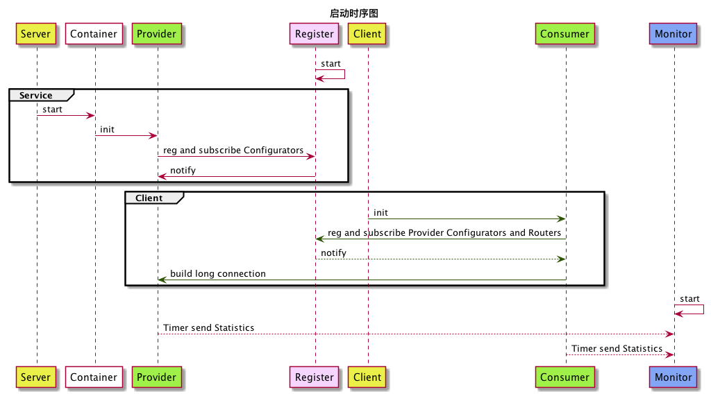

# 徒手解剖dubbo源码（一）架构概述

[TOC]: #

一直打算好好写几篇关于技术的文章，当做笔记，自己可以拿来复习，巩固知识。而且，如果还可以帮到大家，那就荣幸之至了。
最近公司使用dubbo框架，作为client端调用server端的主要工具。所以，自己也硬着头皮，拿出自己那一点点陪领导的时间，来学习dubbo。
dubbo到底是个什么东西，它主要的作用是什么呢？让我们一起带着疑问，徒手一点点的来解剖源码，慢慢的揭开dubbo这神秘而不陌生的面纱。
鉴于，此系列文章是以源码为导向，默认读者在读这些文章时，已经有一些dubbo使用经验。所有，我们不过多的介绍基础概念和使用方法。

## 什么是dubbo?
dubbo是一个高性能的，基于Java的RPC框架由阿里巴巴开源。正如在许多RPC系统，dubbo是根据各个节点定义服务，指定可以使用相应参数远程调用方法，然后返回所需的返回值。在服务器端，服务器实现了一个服务接口，并运行一个dubbo服务来处理客户端调用。在客户端，具有一个存根提供相同的方法作为服务。

借用官网的一张图来，简单说明一下dubbo的架构。

### 组件角色

| 组件       | 角色说明                            |
|:----------|:-----------------------------------|
| Registry  | 服务的注册中心，为服务提供注册与发现    |
| Monitor   | 服务监视器，统计服务调用次数和调用时间等 |
| Provider  | 服务提供方，暴露出服务给调用方         |
| Consumer  | 服务消费者，调用远程服务或本地服务      |
| Container | 服务容器，服务运行的环境              |

### 启动说明

1. 服务容器负责启动，加载，运行服务提供者。
2. 服务提供者在启动时，向注册中心注册自己提供的服务。
3. 服务消费者在启动时，向注册中心订阅自己所需的服务。
4. 注册中心返回服务提供者地址列表给消费者，如果有变更，注册中心将基于长连接推送变更数据给消费者。
5. 服务消费者，从提供者地址列表中，基于软负载均衡算法，选一台提供者进行调用，如果调用失败，再选另一台调用。
6. 服务消费者和提供者，在内存中累计调用次数和调用时间，定时每分钟发送一次统计数据到监控中心。

如下图：

### 重要的技术概念

RPC(Remote procedure call): 远程过程调用
参考：[Remote procedure call](https://en.wikipedia.org/wiki/Remote_procedure_call)
SPI(Service Provider Interfaces): 服务提供者接口
参考：[Oracle SPI-intro](https://docs.oracle.com/javase/tutorial/sound/SPI-intro.html)
Adaptive：这里指的是服务适配器，可动态适配服务实现
Protocol 协议服务
DynamicCompiler 动态编译
Netty:
Zookeeper:
集群容错：
网络通讯协议：
网络通讯编码与解码：

笔者毕竟能力有限，难免有疏漏，如果，大家发现文章有何错误，请不吝赐教。谢谢！

