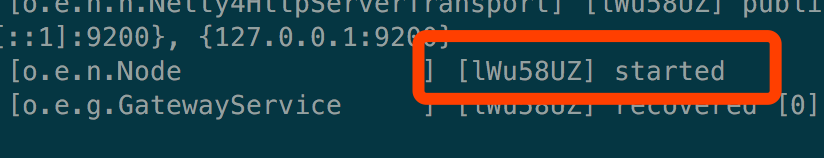
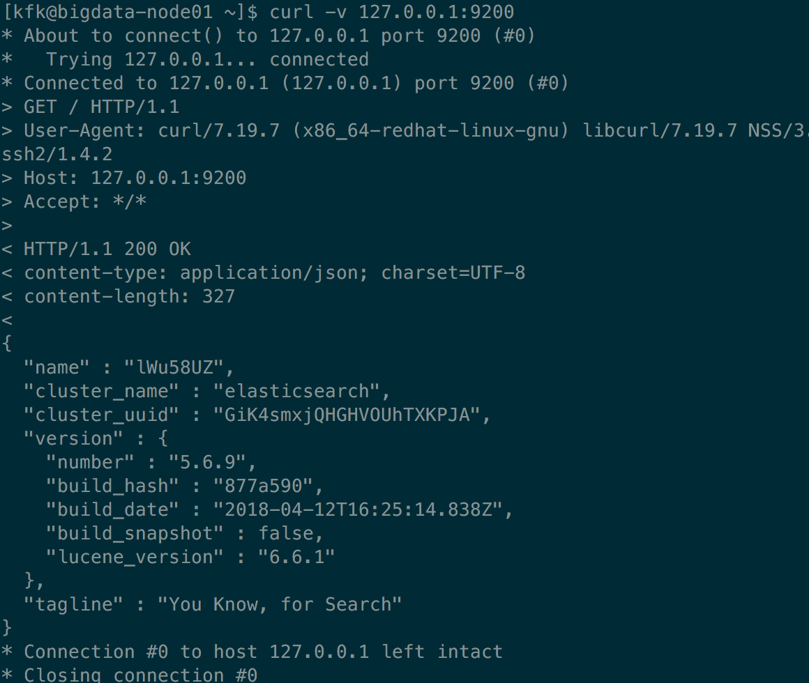

Elasticdsearch 下载与安装
====================


Elasticsearch的使用，基本可以开箱即用。下面我们来简单说明：

##  下载与安装

环境：
Linux CentOS-7
JDK version 1.8.0_131

下载：
我们以 Linux 下的 .tar.gz 压缩包来安装，版本：5.6.9，大家自行选择自己需要的版本
```shell
wget https://artifacts.elastic.co/downloads/elasticsearch/elasticsearch-{version}.tar.gz
wget https://artifacts.elastic.co/downloads/elasticsearch/elasticsearch-5.6.9.tar.gz
wget https://artifacts.elastic.co/downloads/elasticsearch/elasticsearch-5.6.9.tar.gz.sha512
# 这一步做个校验
shasum -a 512 -c elasticsearch-5.6.9.tar.gz.sha512 
```

解压缩：
tar -xzf elasticsearch-5.6.9.tar.gz

在环境变量中添加：


进入解压后的路径：
cd elasticsearch-5.6.9/

运行：
./bin/elasticsearch


等到出现“……started”：

检验是否启动成功：
curl -v 127.0.0.1:9200
请求 ok


至此，一个简单的单机版的 elasticsearch 节点启动成功。
但是，我们不仅仅使用单节点，我们一般需要多节点集群；那么集群怎么部署呢？

下面我们就来一步步配置部署：

1. 命令行启动时添加配置参数：
2. 在配置文件中添加配置参数：

##  .zip 包和 .tar.gz 包目录结构概览

| Type    | Description                                                                                                                                                          | Default Location                           | Setting      |
|:--------|:---------------------------------------------------------------------------------------------------------------------------------------------------------------------|:-------------------------------------------|:-------------|
| home    | Elasticsearch home directory or $ES_HOME                                                                                                                             | Directory created by unpacking the archive |              |
| bin     | Binary scripts including elasticsearch to start a node and elasticsearch-plugin to install plugins                                                                   | $ES_HOME/bin                               |              |
| conf    | Configuration files including elasticsearch.yml                                                                                                                      | $ES_HOME/config                            | ES_PATH_CONF |
| data    | The location of the data files of each index / shard allocated on the node. Can hold multiple locations.                                                             | $ES_HOME/data                              | path.data    |
| logs    | Log files location.                                                                                                                                                  | $ES_HOME/logs                              | path.logs    |
| plugins | Plugin files location. Each plugin will be contained in a subdirectory.                                                                                              | $ES_HOME/plugins                           |              |
| repo    | Shared file system repository locations. Can hold multiple locations. A file system repository can be placed in to any subdirectory of any directory specified here. | Not configured                             | path.repo    |
| script  | Location of script files.                                                                                                                                            | $ES_HOME/scripts                           | path.scripts |

## Configuring Elasticsearch

### 默认的 JVM 配置：
```
"-Xms2g",
"-Xmx2g",
"-XX:+UseConcMarkSweepGC",
"-XX:CMSInitiatingOccupancyFraction=75",
"-XX:+UseCMSInitiatingOccupancyOnly",
"-XX:+AlwaysPreTouch",
"-Xss1m",
"-Djava.awt.headless=true",
"-Dfile.encoding=UTF-8",
"-Djna.nosys=true",
"-Djdk.io.permissionsUseCanonicalPath=true",
"-Dio.netty.noUnsafe=true",
"-Dio.netty.noKeySetOptimization=true",
"-Dio.netty.recycler.maxCapacityPerThread=0",
"-Dlog4j.shutdownHookEnabled=false",
"-Dlog4j2.disable.jmx=true",
"-Dlog4j.skipJansi=true",
"-XX:+HeapDumpOnOutOfMemoryError",
"-Des.path.home=/opt/modules/elasticsearch-5.6.9"
```

### 重要的配置

虽然，elasticsearch 仅仅需要很简单的配置就可以运行起来，但是，如果需要使用在生产环境中，还需要关心很多配置。

The following settings must be considered before going to production:

- Path settings
- Cluster name
- Node name
- Network host
- Discovery settings
- Heap size
- Heap dump path
- GC logging

### Advanced TCP Settingsedit
Any component that uses TCP (like the HTTP and Transport modules) share the following settings:

network.tcp.no_delay

Enable or disable the TCP no delay setting. Defaults to true.

network.tcp.keep_alive

Enable or disable TCP keep alive. Defaults to true.

network.tcp.reuse_address

Should an address be reused or not. Defaults to true on non-windows machines.

network.tcp.send_buffer_size

The size of the TCP send buffer (specified with size units). By default not explicitly set.

network.tcp.receive_buffer_size

The size of the TCP receive buffer (specified with size units). By default not explicitly set.


## System important setting

/etc/security/limit.conf
kfk	- 	nofile	65536
\# allow user 'kfk' mlockall
kfk soft memlock unlimited
kfk hard memlock unlimited

sudo su  
ulimit -n 65536
su elasticsearch

ulimit -u 4096

#### Virtual memoryedit
sysctl -w vm.max_map_count=262144


笔者毕竟能力有限，难免有疏漏，如果，大家发现文章有何错误，请不吝赐教。谢谢！