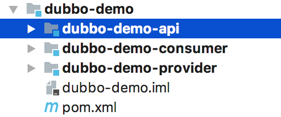
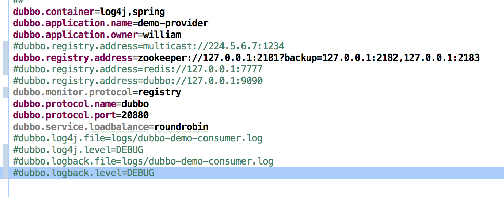
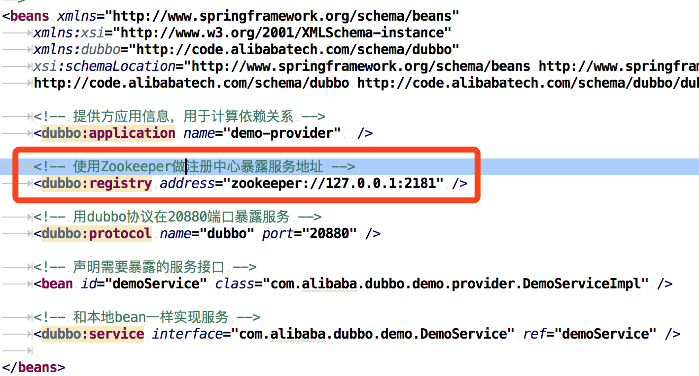
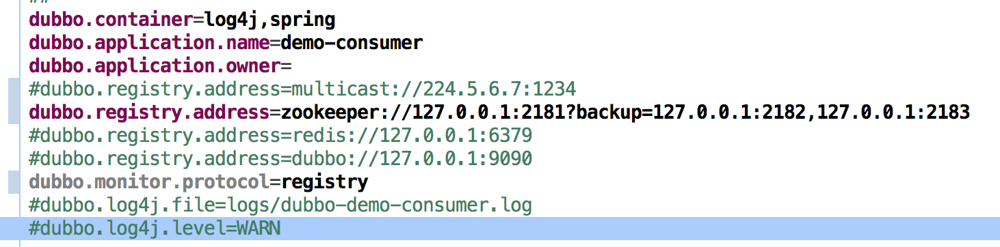
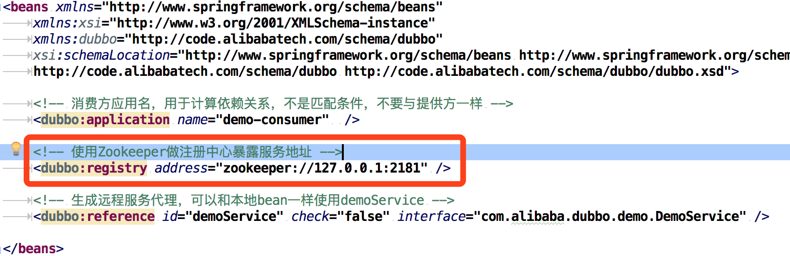

# Dubbo源码解剖（一）架构概览与调试环境准备

居然你已经开始读源码，默认你已经有了开发基础，有些基础我们不会再说明。这一节我们预热，做一些准备工作。要盖高楼大厦，总得做备好工具，画好蓝图；随便拿几张草稿纸，拿着砖刀，就想搞高楼，那是妄想。

### 使用到的工具

- JDK 1.8.x
- Maven 3.3.x
- Git
- IntelliJ IDEA
- Zookeeper
- ……
工具的下载、安装、配置不是我们这里的重点，如果这些还不能自理的，请先绕道吧。

### 获取源码

要读源码首先要获取源码

- 简单说明如何获取源码
截止成文，Dubbo已经在apache中进行再次孵化，网站为：http://dubbo.apache.org/
找到github网址: https://github.com/apache/incubator-dubbo
我们可以直接：

	git clone https://github.com/apache/incubator-dubbo.git
	或
	git clone git@github.com:apache/incubator-dubbo.git

- 但是还是建议，先fork之后，在clone下来，应为这样我们就有一个自己的干净的阅读源码的工程，可以在fork的源码中注意些笔记和标注。

Dubboz在成文时最新的release版本为：2.6.1，2.6.x与2.5.x版本有不少的改变，我们该系列文章还是2.5.x版本来学习。2.6.x与2.5.x版本的差异，我们之后再做研究讨论。

项目克隆完后，导入到 IntelliJ IDEA 中，第一次导入需要些时间，等待maven下载依赖和编译。
这里使用的2.5.x版本，项目中有以下子项目。


### 架构简介

导入成功后我们首先运行demo验证环境是否配置正确，项目是否可以运行成功，这样才能保证我们可以阅读调试源码。
运行demo之前我们先来看看官方提供的简单架构图：


对图中的组件简单的说明：

| 组件       | 角色说明                            |
|:----------|:-----------------------------------|
| Registry  | 服务的注册中心，为服务提供注册与发现    |
| Monitor   | 服务监视器，统计服务调用次数和调用时间等 |
| Provider  | 服务提供方，暴露出服务给调用方         |
| Consumer  | 服务消费者，调用远程服务或本地服务      |
| Container | 服务容器，服务运行的环境              |

启动顺序

1. 服务容器负责启动，加载，运行服务提供者。
2. 服务提供者在启动时，向注册中心注册自己提供的服务。
3. 服务消费者在启动时，向注册中心订阅自己所需的服务。
4. 注册中心返回服务提供者地址列表给消费者，如果有变更，注册中心将基于长连接推送变更数据给消费者。
5. 服务消费者，从提供者地址列表中，基于软负载均衡算法，选一台提供者进行调用，如果调用失败，再选另一台调用。
6. 服务消费者和提供者，在内存中累计调用次数和调用时间，定时每分钟发送一次统计数据到监控中心。

如下图：


### 运行例子程序
#### 找到demo子项目


里面有三个子项目，简单说明一下：

- dubbo-demo-api 提供服务接口项目
- dubbo-demo-consumer 服务消费者
- dubbo-demo-provider 服务提供者

#### 运行Provider

1. 我们需要启动Zookeeper
2. 配置Provider的dubbo.properties

3. 配置dubbo-demo-provider.xml

4. 找到DemoProvider，run or debug
如果顺利，你最终会在console看到：“Dubbo service server started!”
```
[27/04/18 09:49:53:053 CST] main-SendThread()  INFO zookeeper.ClientCnxn: Opening socket connection to server /127.0.0.1:2181
[27/04/18 09:49:53:053 CST] main-SendThread(localhost:2181)  INFO zookeeper.ClientCnxn: Socket connection established to localhost/127.0.0.1:2181, initiating session
[27/04/18 09:49:53:053 CST] main-SendThread(localhost:2181)  INFO zookeeper.ClientCnxn: Session establishment complete on server localhost/127.0.0.1:2181, sessionid = 0x100000078590005, negotiated timeout = 30000
[27/04/18 09:49:53:053 CST] main-EventThread  INFO zkclient.ZkClient: zookeeper state changed (SyncConnected)
[27/04/18 09:49:53:053 CST] main  INFO zookeeper.ZookeeperRegistry:  [DUBBO] Register: dubbo://192.168.10.44:20880/com.alibaba.dubbo.demo.DemoService?anyhost=true&application=demo-provider&dubbo=2.0.0&generic=false&interface=com.alibaba.dubbo.demo.DemoService&loadbalance=roundrobin&methods=sayHello&owner=william&pid=34925&side=provider&timestamp=1524793792543, dubbo version: 2.0.0, current host: 127.0.0.1
[27/04/18 09:49:53:053 CST] main  INFO zookeeper.ZookeeperRegistry:  [DUBBO] Subscribe: provider://192.168.10.44:20880/com.alibaba.dubbo.demo.DemoService?anyhost=true&application=demo-provider&category=configurators&check=false&dubbo=2.0.0&generic=false&interface=com.alibaba.dubbo.demo.DemoService&loadbalance=roundrobin&methods=sayHello&owner=william&pid=34925&side=provider&timestamp=1524793792543, dubbo version: 2.0.0, current host: 127.0.0.1
[27/04/18 09:49:53:053 CST] main  INFO zookeeper.ZookeeperRegistry:  [DUBBO] Notify urls for subscribe url provider://192.168.10.44:20880/com.alibaba.dubbo.demo.DemoService?anyhost=true&application=demo-provider&category=configurators&check=false&dubbo=2.0.0&generic=false&interface=com.alibaba.dubbo.demo.DemoService&loadbalance=roundrobin&methods=sayHello&owner=william&pid=34925&side=provider&timestamp=1524793792543, urls: [empty://192.168.10.44:20880/com.alibaba.dubbo.demo.DemoService?anyhost=true&application=demo-provider&category=configurators&check=false&dubbo=2.0.0&generic=false&interface=com.alibaba.dubbo.demo.DemoService&loadbalance=roundrobin&methods=sayHello&owner=william&pid=34925&side=provider&timestamp=1524793792543], dubbo version: 2.0.0, current host: 127.0.0.1
[27/04/18 09:49:53:053 CST] main  INFO container.Main:  [DUBBO] Dubbo SpringContainer started!, dubbo version: 2.0.0, current host: 127.0.0.1
[2018-04-27 09:49:53] Dubbo service server started!
```

#### 启动完Provider，接下来启动Consumer

1. 配置Consumer的dubbo.properties

2. 配置dubbo-demo-consumer.xml

3. 找到DemoConsumer，run or debug
如果顺利，你最终会在console看到：

Consumer端的console会打印出：
```
[27/04/18 09:54:05:005 CST] main  INFO zookeeper.ZookeeperRegistry:  [DUBBO] Register: consumer://192.168.10.44/com.alibaba.dubbo.demo.DemoService?application=demo-consumer&category=consumers&check=false&dubbo=2.0.0&interface=com.alibaba.dubbo.demo.DemoService&methods=sayHello&pid=35044&side=consumer&timestamp=1524794044782, dubbo version: 2.0.0, current host: 192.168.10.44
[27/04/18 09:54:05:005 CST] main  INFO zookeeper.ZookeeperRegistry:  [DUBBO] Subscribe: consumer://192.168.10.44/com.alibaba.dubbo.demo.DemoService?application=demo-consumer&category=providers,configurators,routers&check=false&dubbo=2.0.0&interface=com.alibaba.dubbo.demo.DemoService&methods=sayHello&pid=35044&side=consumer&timestamp=1524794044782, dubbo version: 2.0.0, current host: 192.168.10.44
[27/04/18 09:54:05:005 CST] main  INFO zookeeper.ZookeeperRegistry:  [DUBBO] Notify urls for subscribe url consumer://192.168.10.44/com.alibaba.dubbo.demo.DemoService?application=demo-consumer&category=providers,configurators,routers&check=false&dubbo=2.0.0&interface=com.alibaba.dubbo.demo.DemoService&methods=sayHello&pid=35044&side=consumer&timestamp=1524794044782, urls: [dubbo://192.168.10.44:20880/com.alibaba.dubbo.demo.DemoService?anyhost=true&application=demo-provider&dubbo=2.0.0&generic=false&interface=com.alibaba.dubbo.demo.DemoService&loadbalance=roundrobin&methods=sayHello&owner=william&pid=34925&side=provider&timestamp=1524793792543, empty://192.168.10.44/com.alibaba.dubbo.demo.DemoService?application=demo-consumer&category=configurators&check=false&dubbo=2.0.0&interface=com.alibaba.dubbo.demo.DemoService&methods=sayHello&pid=35044&side=consumer&timestamp=1524794044782, empty://192.168.10.44/com.alibaba.dubbo.demo.DemoService?application=demo-consumer&category=routers&check=false&dubbo=2.0.0&interface=com.alibaba.dubbo.demo.DemoService&methods=sayHello&pid=35044&side=consumer&timestamp=1524794044782], dubbo version: 2.0.0, current host: 192.168.10.44
[27/04/18 09:54:05:005 CST] main  INFO transport.AbstractClient:  [DUBBO] Successed connect to server /192.168.10.44:20880 from NettyClient 192.168.10.44 using dubbo version 2.0.0, channel is NettyChannel [channel=[id: 0x409bf450, /192.168.10.44:64211 => /192.168.10.44:20880]], dubbo version: 2.0.0, current host: 192.168.10.44
[27/04/18 09:54:05:005 CST] main  INFO transport.AbstractClient:  [DUBBO] Start NettyClient Luxx.local/192.168.10.44 connect to the server /192.168.10.44:20880, dubbo version: 2.0.0, current host: 192.168.10.44
[27/04/18 09:54:05:005 CST] main  INFO config.AbstractConfig:  [DUBBO] Refer dubbo service com.alibaba.dubbo.demo.DemoService from url zookeeper://127.0.0.1:2181/com.alibaba.dubbo.registry.RegistryService?anyhost=true&application=demo-consumer&check=false&dubbo=2.0.0&generic=false&interface=com.alibaba.dubbo.demo.DemoService&loadbalance=roundrobin&methods=sayHello&monitor=dubbo%3A%2F%2F127.0.0.1%3A2181%2Fcom.alibaba.dubbo.registry.RegistryService%3Fapplication%3Ddemo-consumer%26dubbo%3D2.0.0%26pid%3D35044%26protocol%3Dregistry%26refer%3Ddubbo%253D2.0.0%2526interface%253Dcom.alibaba.dubbo.monitor.MonitorService%2526pid%253D35044%2526timestamp%253D1524794045101%26registry%3Dzookeeper%26timestamp%3D1524794045063&owner=william&pid=35044&side=consumer&timestamp=1524794044782, dubbo version: 2.0.0, current host: 192.168.10.44
[27/04/18 09:54:06:006 CST] main  INFO zookeeper.ZookeeperRegistry:  [DUBBO] Register: consumer://192.168.10.44/com.alibaba.dubbo.monitor.MonitorService?category=consumers&check=false&dubbo=2.0.0&interface=com.alibaba.dubbo.monitor.MonitorService&pid=35044&timestamp=1524794045101, dubbo version: 2.0.0, current host: 192.168.10.44
[27/04/18 09:54:06:006 CST] main  INFO zookeeper.ZookeeperRegistry:  [DUBBO] Subscribe: consumer://192.168.10.44/com.alibaba.dubbo.monitor.MonitorService?category=providers,configurators,routers&dubbo=2.0.0&interface=com.alibaba.dubbo.monitor.MonitorService&pid=35044&timestamp=1524794045101, dubbo version: 2.0.0, current host: 192.168.10.44
[27/04/18 09:54:06:006 CST] main  INFO zookeeper.ZookeeperRegistry:  [DUBBO] Notify urls for subscribe url consumer://192.168.10.44/com.alibaba.dubbo.monitor.MonitorService?category=providers,configurators,routers&dubbo=2.0.0&interface=com.alibaba.dubbo.monitor.MonitorService&pid=35044&timestamp=1524794045101, urls: [empty://192.168.10.44/com.alibaba.dubbo.monitor.MonitorService?category=providers&dubbo=2.0.0&interface=com.alibaba.dubbo.monitor.MonitorService&pid=35044&timestamp=1524794045101, empty://192.168.10.44/com.alibaba.dubbo.monitor.MonitorService?category=configurators&dubbo=2.0.0&interface=com.alibaba.dubbo.monitor.MonitorService&pid=35044&timestamp=1524794045101, empty://192.168.10.44/com.alibaba.dubbo.monitor.MonitorService?category=routers&dubbo=2.0.0&interface=com.alibaba.dubbo.monitor.MonitorService&pid=35044&timestamp=1524794045101], dubbo version: 2.0.0, current host: 192.168.10.44
[09:54:06] Hello world 0, response form provider: 192.168.10.44:20880
[09:54:08] Hello world 1, response form provider: 192.168.10.44:20880
[09:54:10] Hello world 2, response form provider: 192.168.10.44:20880
[09:54:12] Hello world 3, response form provider: 192.168.10.44:20880
[09:54:14] Hello world 4, response form provider: 192.168.10.44:20880
[09:54:16] Hello world 5, response form provider: 192.168.10.44:20880
[09:54:18] Hello world 6, response form provider: 192.168.10.44:20880
[09:54:20] Hello world 7, response form provider: 192.168.10.44:20880
[09:54:22] Hello world 8, response form provider: 192.168.10.44:20880
```

Provider端的console会打印出：
```
[09:54:06] Hello world 0, request from consumer: /192.168.10.44:64211
[27/04/18 09:54:06:006 CST] DubboServerHandler-192.168.10.44:20880-thread-2  INFO zookeeper.ZookeeperRegistry:  [DUBBO] Register: consumer://192.168.10.44/com.alibaba.dubbo.monitor.MonitorService?category=consumers&check=false&dubbo=2.0.0&interface=com.alibaba.dubbo.monitor.MonitorService&pid=34925&timestamp=1524793793056, dubbo version: 2.0.0, current host: 192.168.10.44
[27/04/18 09:54:06:006 CST] DubboServerHandler-192.168.10.44:20880-thread-2  INFO zookeeper.ZookeeperRegistry:  [DUBBO] Subscribe: consumer://192.168.10.44/com.alibaba.dubbo.monitor.MonitorService?category=providers,configurators,routers&dubbo=2.0.0&interface=com.alibaba.dubbo.monitor.MonitorService&pid=34925&timestamp=1524793793056, dubbo version: 2.0.0, current host: 192.168.10.44
[27/04/18 09:54:06:006 CST] DubboServerHandler-192.168.10.44:20880-thread-2  INFO zookeeper.ZookeeperRegistry:  [DUBBO] Notify urls for subscribe url consumer://192.168.10.44/com.alibaba.dubbo.monitor.MonitorService?category=providers,configurators,routers&dubbo=2.0.0&interface=com.alibaba.dubbo.monitor.MonitorService&pid=34925&timestamp=1524793793056, urls: [empty://192.168.10.44/com.alibaba.dubbo.monitor.MonitorService?category=providers&dubbo=2.0.0&interface=com.alibaba.dubbo.monitor.MonitorService&pid=34925&timestamp=1524793793056, empty://192.168.10.44/com.alibaba.dubbo.monitor.MonitorService?category=configurators&dubbo=2.0.0&interface=com.alibaba.dubbo.monitor.MonitorService&pid=34925&timestamp=1524793793056, empty://192.168.10.44/com.alibaba.dubbo.monitor.MonitorService?category=routers&dubbo=2.0.0&interface=com.alibaba.dubbo.monitor.MonitorService&pid=34925&timestamp=1524793793056], dubbo version: 2.0.0, current host: 192.168.10.44
[09:54:08] Hello world 1, request from consumer: /192.168.10.44:64211
[09:54:10] Hello world 2, request from consumer: /192.168.10.44:64211
[09:54:12] Hello world 3, request from consumer: /192.168.10.44:64211
[09:54:14] Hello world 4, request from consumer: /192.168.10.44:64211
[09:54:16] Hello world 5, request from consumer: /192.168.10.44:64211
[09:54:18] Hello world 6, request from consumer: /192.168.10.44:64211
[09:54:20] Hello world 7, request from consumer: /192.168.10.44:64211
[09:54:22] Hello world 8, request from consumer: /192.168.10.44:64211
```

至此，我们已经配置好dubbo的调试环境。
笔者毕竟能力有限，难免有疏漏，如果，大家发现文章有何错误，请不吝赐教。谢谢！
